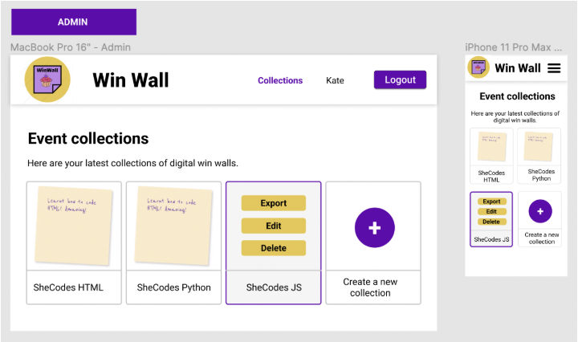
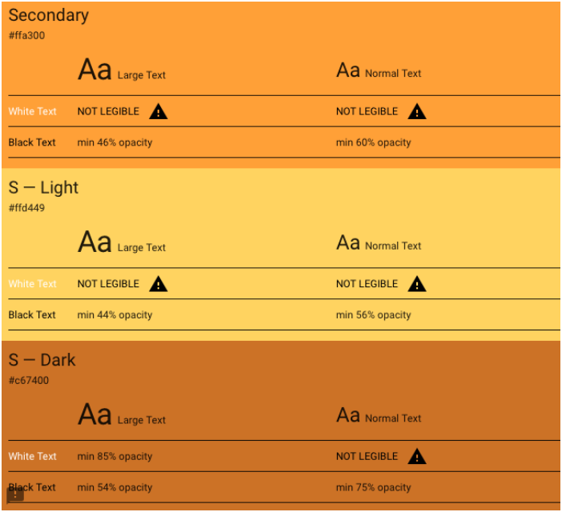
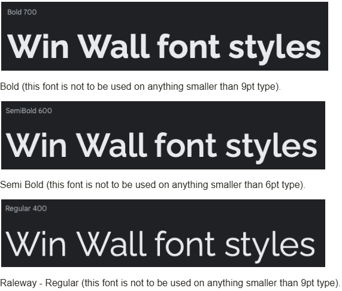

# post-IT-ivity
> By the Quantum Quokkas
- Sandra M
- Tenille S
- Laura S
- Roda A
- Caitlin A

## Table of Contents

- [post-IT-ivity](#post-it-ivity)
  - [Table of Contents](#table-of-contents)
  - [Mission Statement](#mission-statement)
  - [Features](#features)
    - [Summary](#summary)
    - [Users](#users)
    - [Post-It Notes](#post-it-notes)
    - [Workshops](#workshops)
    - [Pages/Endpoint Functionality](#pagesendpoint-functionality)
    - [Nice To Haves](#nice-to-haves)
  - [Technical Implementation](#technical-implementation)
    - [Back-End](#back-end)
    - [Front-End](#front-end)
    - [Git \& Deployment](#git--deployment)
  - [Target Audience](#target-audience)
  - [Back-end Implementation](#back-end-implementation)
    - [API Specification](#api-specification)
- [API Documentation](#api-documentation)
    - [Object Definitions](#object-definitions)
      - [User](#user)
      - [Workshop](#workshop)
      - [Note](#note)
      - [Location](#location)
      - [Cohort](#cohort)
      - [Note Category](#note-category)
      - [Category](#category)
      - [Coding Language](#coding-language)
      - [Organisation](#organisation)
    - [](#)
    - [Database Schema](#database-schema)
  - [Front-end Implementation](#front-end-implementation)
    - [Wireframes](#wireframes)
      - [Home Page](#home-page)
      - [Collection List Page](#collection-list-page)
    - [Logo](#logo)
    - [Colours](#colours)
      - [Primary](#primary)
      - [Secondary](#secondary)
    - [Font](#font)


## Mission Statement

> [!NOTE]  
Postitivity empowers She Codes learners to celebrate their coding journey by capturing, sharing, and preserving their musings via a stick it note in a collaborative digital space. Our platform transforms fleeting moments of achievement into lasting inspiration, fostering a supportive community where every step forward is acknowledged and celebrated. Through seamless real-time sharing and intuitive documentation, we help students recognize that their collective small victories build the foundation for lasting success in tech.

## Features

> [!NOTE]  
> Tell me the features your website will and will not have. Give detailed explanations, this is where you define the scope of your project. Example below.


### Summary 
Users and admins will be able to add notes and information via preset fields, they can search other users notes and comment on them. Data will only be able to be deleted via superusers, all other data will be archived or ‘soft deleted’.

### Users

| Type               | Access                                                                                                                                                                                                                                                                                             | Role type assignment                                |
| :----------------- | :------------------------------------------------------------------------------------------------------------------------------------------------------------------------------------------------------------------------------------------------------------------------------------------------- | :-------------------------------------------------- |
| Superuser | - All access <br> - Log in <br> - Log out <br> - Create and manage workshops <br> -Manage other users <br> - Approve, archive and edit(owned) notes <br> Edit/archive/delete workshops <br> - View and edit their details via account page <br> - Add locations for workshops <br> - Add organisations that can create workshops <br> - All basic user functionality | Product Owner                                                |
| Admin           | <br> - Log in  <br> - Log out  <br> - Approve, archive and edit(owned) notes  <br> - Edit/archive owned workshops <br> - Archive/delete notes in owned workshops<br> - Post notes for other users in owned workshops <br> - View and edit their details via account page <br> - All basic user functionality<br>                                                                                                                                                  | Staff          |
| User              |<br> - Log in  <br> - Log out  <br> - Create and submit post it notes <br> - Choice to post anonymously <br> Edit/archive owned notes <br> - View and edit their details via account page <br> - View workshops board with related post it notes<br>                                                                | Public: Users who attend workshops |

### Post-It Notes

| Feature                                        | Access                                                                                                                                                                                                           | Notes/Conditions                                                                                              |
| :--------------------------------------------- | :--------------------------------------------------------------------------------------------------------------------------------------------------------------------------------------------------------------- | :------------------------------------------------------------------------------------------------------------ |
| Create                                         | Can be created by anyone logged in                                                                                                                                                                               | <br> - Limit length of post-it note text  <br> - option to add hashtag (TBC: as main text or additional field) |
| Post                                           | Post as user or anonymously                                                                                                                                                                                                    | <br> - Submits post-it note to workshops                                                                |
| View                                           | Can be viewed by anyone with the URL	                                                                                      |                                                                                                               |
| Edit                                           | Can be edited by owner of notes	                                                                                                                                                                           | <br> -  Edit sticky note text, eg: for spelling errors                     |
| Statuses: Active, Archived	 | Posted notes will be active by default	|          - Anyone can archive a note they own <br> - Owners of a workshops can archive/delete notes posted on it                                                                                                     |
| EXAMPLE                                         | EXAMPLE                                                                                                                | EXAMPLE                                         |


### Workshops

| Feature                           | Access                     | Notes/Conditions           |
| :-------------------------------- | :------------------------- | :------------------------- |
| Create     | Superuser/Admin can create workshops |                            |
| Assign approver to a collection   | <br> - admin               |                            |
| Default event board live duration | <br> - Admin               | <br> - Based on event type |
| View event boards by collection   | <br> - Admin, Approver     |                            |
| Export notes by Collection        | <br> - Admin               |                            |

### Pages/Endpoint Functionality

| Endpoint              | functionality                                                                                                                                                                     | comments                                                                                         |
| :-------------------- | :-------------------------------------------------------------------------------------------------------------------------------------------------------------------------------- | :----------------------------------------------------------------------------------------------- |
| Create and post notes | <br> - Available to anyone logged into to an account  <br> - Add post it notes   <br> - Submit post it notes                                                                                          | <br> - Sticky note ‘feel’ is preferred  <br> - Easy to read and accessible  <br> - Good contrast |
| Workshops board           | <br> - Once note is posted, redirect to page of the workshop  <br> - Able to post more notes (redirect back or add directly?)  <br> - Post it notes can be added to a workshop up to 1 month after the workshop <br> - search notes by text/hashtag                                      |
| Admin page            | - All admin functions  <br> - can also create another admin account                                                                                                                 | <br> - Requires auth  <br> - initial admin created by DB                                         |
| Register as Approver  | <br> - users can register as approvers  <br> - once registered, approver can log in                                                                                               | Requires shecodes email address to be used                                                       |
| Approver page         | Approver functions                                                                                                                                                                | Requires auth Easy to read, accessible, easy to use for new users                                |
| Profile page          | <br> - All registered users  <br> - Can view their personal info  <br> - Can update their info                                                                                    | Requires auth                                                                                    |

### Nice To Haves

- Be able to "like/heart" a post it note
- Ability for superuser or workshop owner admin to contact user via their post it note (e.g. if the note was not positive, be able to reach out to them for more feedback)
- Register to workshops
- View workshops that the logged in user has checked as attending
- View past attended workshops

## Technical Implementation

### Back-End

- Django / DRF API
- Python

### Front-End

- React / JavaScript
- HTML/CSS

### Git & Deployment
- Heroku
- Netlify
- GitHub

This application's back-end will be deployed to Heroku. The front-end will be deployed separately to Netlify.

We will also use Insomnia to ensure API endpoints are working smoothly (we will utilise a local and deployed environment in Insomnia).

## Target Audience

Our platform supports three user roles. Project owners (superusers) have full platform access, managing all workshops and notes. Organization admins can create and manage their own workshops while moderating associated content. Workshop participants can view all content and engage through creating and managing their own notes. This structure enables organizations to host workshops while maintaining content control and allowing participant interaction.Our platform supports three user roles.

## Back-end Implementation
### API Specification

# API Documentation

Colors:
- <span style="color:blue">**Blue**</span>: Required fields
- <span style="color:magenta">**Magenta**</span>: Auto-filled fields

| HTTP | URL | Purpose | Request Body | Success Response | Auth |
|------|-----|---------|--------------|------------------|------|
| GET | /admin/ | Django Admin Interface | None | 200 OK | Admin |
| POST | /api-token-auth/ | Get auth token | {<br><span style="color:blue">**"username"**</span>: "string",<br><span style="color:blue">**"password"**</span>: "string"<br>} | 200 OK<br>{<br>"token": "string",<br>"user_id": "int",<br>"email": "string",<br>"username": "string",<br>"first_name": "string"<br>} | No |
| GET | /users/ | List all users | None | 200 OK | No |
| POST | /signup/ | Create new user | {<br><span style="color:blue">**"username"**</span>: "string",<br><span style="color:blue">**"password"**</span>: "string",<br>"first_name": "string",<br>"last_name": "string",<br>"email": "string",<br>"organisation": "int"<br>} | 201 Created | No |
| POST | /login/ | Login user | {<br><span style="color:blue">**"username"**</span>: "string",<br><span style="color:blue">**"password"**</span>: "string"<br>} | 200 OK<br>{<br>"token": "string",<br>"user_id": "int",<br>"email": "string",<br>"username": "string",<br>"first_name": "string"<br>} | No |
| GET | /users/\<id>/ | Get user details | None | 200 OK | No |
| PATCH | /users/\<id>/ | Update user | {<br>"username": "string",<br>"password": "string",<br>"first_name": "string",<br>"last_name": "string",<br>"email": "string",<br>"organisation": "int"<br>} | 200 OK | Auth Required |
| GET | /workshops/ | List workshops | None | 200 OK | No |
| POST | /workshops/ | Create workshop | {<br><span style="color:blue">**"title"**</span>: "string",<br><span style="color:blue">**"description"**</span>: "string",<br><span style="color:blue">**"start_date"**</span>: "datetime",<br><span style="color:blue">**"end_date"**</span>: "datetime",<br><span style="color:blue">**"location"**</span>: "int",<br>"image_url": "string",<br>"category": "int",<br>"coding_language": "int",<br>"organisation": "int",<br><span style="color:magenta">**"created_by_user"**</span>: "int"<br>} | 201 Created | Auth Required |
| GET | /workshops/\<id>/ | Get workshop details | None | 200 OK | No |
| PUT | /workshops/\<id>/ | Update workshop | {<br>"title": "string",<br>"description": "string",<br>"start_date": "datetime",<br>"end_date": "datetime",<br>"image_url": "string",<br>"location": "int",<br>"category": "int",<br>"coding_language": "int",<br>"organisation": "int",<br>"is_archived": "boolean",<br>"archive_details": "int"<br>} | 200 OK | Owner/Admin |
| GET | /notes/ | List notes | None | 200 OK | No |
| POST | /notes/ | Create note | {<br><span style="color:blue">**"content"**</span>: "string",<br><span style="color:blue">**"workshop"**</span>: "int",<br>"anonymous": "boolean",<br>"note_category": "int",<br>"coding_language": "int",<br><span style="color:magenta">**"user"**</span>: "int",<br><span style="color:magenta">**"added_by_user"**</span>: "int",<br><span style="color:magenta">**"likes_count"**</span>: "int",<br><span style="color:magenta">**"is_archived"**</span>: "boolean"<br>} | 201 Created | Auth Required |
| GET | /locations/ | List locations | None | 200 OK | Admin |
| POST | /locations/ | Create location | {<br><span style="color:blue">**"location"**</span>: "string",<br><span style="color:magenta">**"added_by_user"**</span>: "int"<br>} | 201 Created | Admin |
| GET | /locations/\<id>/ | Get location details | None | 200 OK | Admin |
| PUT | /locations/\<id>/ | Update location | {<br>"location": "string",<br>"is_archived": "boolean"<br>} | 200 OK | Admin |
| GET | /organisations/ | List organisations | None | 200 OK | Admin |
| POST | /organisations/ | Create organisation | {<br><span style="color:blue">**"organisation_name"**</span>: "string",<br><span style="color:magenta">**"added_by_user"**</span>: "int"<br>} | 201 Created | Admin |
| GET | /organisations/\<id>/ | Get organisation details | None | 200 OK | Admin |
| PUT | /organisations/\<id>/ | Update organisation | {<br>"organisation_name": "string",<br>"is_archived": "boolean"<br>} | 200 OK | Admin |


### Object Definitions

> [!NOTE]  
> Define the actual objects that your API returns. The example GET method above says it returns “all projects”, so we need to define what a “project” looks like. Example below.

#### User
| Field | Data Type |
| :---- | :-------- |
| id (PK) | integer |
| username | string |
| first_name | string |
| email | string |
| is_staff | boolean |
| is_superuser | boolean |

#### Workshop
| Field | Data Type |
| :---- | :-------- |
| id (PK) | integer |
| title | string |
| description | string |
| start_date | datetime |
| end_date | datetime |
| date_created | datetime |
| owner (FK) | object (User) |
| location (FK) | integer |
| location_id (FK) | object (Location) |
| organisation (FK) | integer |
| organisation_id (FK) | object (Organisation) |
| is_archived | boolean |
| archive_reason | string |
| archive_user (FK) | object (User) |
| notes | array (Note) |

#### Note
| Field | Data Type |
| :---- | :-------- |
| id (PK) | integer |
| added_by_user (FK) | object (User) |
| user (FK) | object (User) |
| content | string |
| workshop (FK) | integer |
| workshop_id (FK) | object (Workshop) |
| likes_count | integer |
| anonymous | boolean |
| date_created | datetime |
| is_archived | boolean |
| archive_reason | string |
| archive_user (FK) | object (User) |

#### Location
| Field | Data Type |
| :---- | :-------- |
| id (PK) | integer |
| location | string |
| is_archived | boolean |

#### Cohort
| Field | Data Type |
| :---- | :-------- |
| id (PK) | integer |
| cohort_name | string |

#### Note Category
| Field | Data Type |
| :---- | :-------- |
| id (PK) | integer |
| note_category_name | string |

#### Category
| Field | Data Type |
| :---- | :-------- |
| id (PK) | integer |
| category_name | string |

#### Coding Language
| Field | Data Type |
| :---- | :-------- |
| id (PK) | integer |
| language | string |

#### Organisation
| Field | Data Type |
| :---- | :-------- |
| id (PK) | integer |
| organisation_name | string |
| is_archived | boolean |


###


### Database Schema
> [!NOTE]  
> Insert an image of your database schema (could be a photo of a hand-drawn schema or a screenshot of a schema created using a tool such as ​​https://drawsql.app/). Example below.


## Front-end Implementation

### Wireframes

> [!NOTE]  
> Insert image(s) of your wireframes (could be a photo of hand-drawn wireframes or a screenshot of wireframes created using a tool such as https://www.mockflow.com/).

See all wireframes and how Admins, Approvers and Students would see the Win Wall website: https://www.figma.com/file/cvP0Kc7lAX39Fvo12C5aLa/Win-Wall?node-id=22%3A1345 

#### Home Page


#### Collection List Page


> [!NOTE]  
> etc...

### Logo


### Colours
#### Primary


#### Secondary



### Font

(We will create a ‘highlight-text’ font style in CSS with the glow effect as per the above - to use on hero section)
Raleway
Google fonts:

```css
@import url('https://fonts.googleapis.com/css2?family=Raleway:wght@400;600;700&display=swap');
font-family: 'Raleway', sans-serif;
```
(When Raleway is not available the standard font to be used is the Calibri font family)

